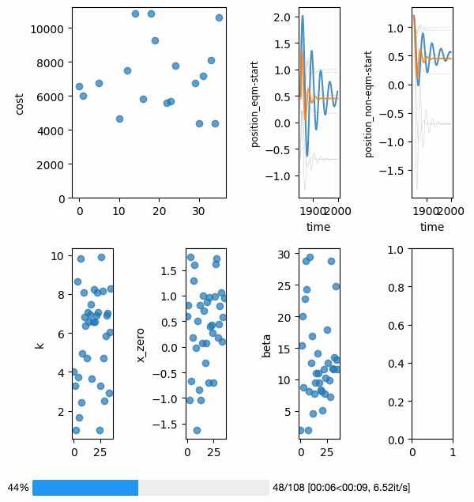
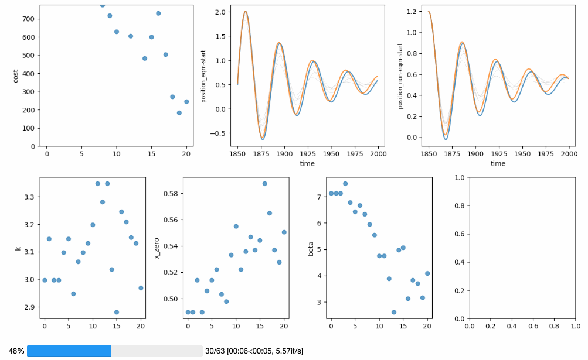
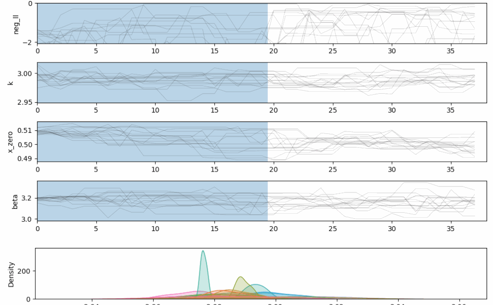

---8<--- "README.md:description"

OpenSCM-Calibration supports multiple types of optimisation and fitting

**Global optimisation**

**Local optimisation**

**Markov chain Monte Carlo**

## Where to next?

If you want to use OpenSCM Calibration,
here are some other potential points of interest:

- Installation instructions: [Installation][installation]
- How-to guides: [How-to...][how-to-guides]
- The full API docs: [API reference][openscm_calibration]
