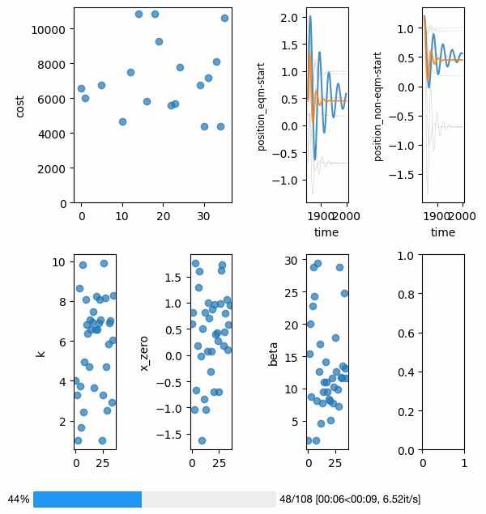
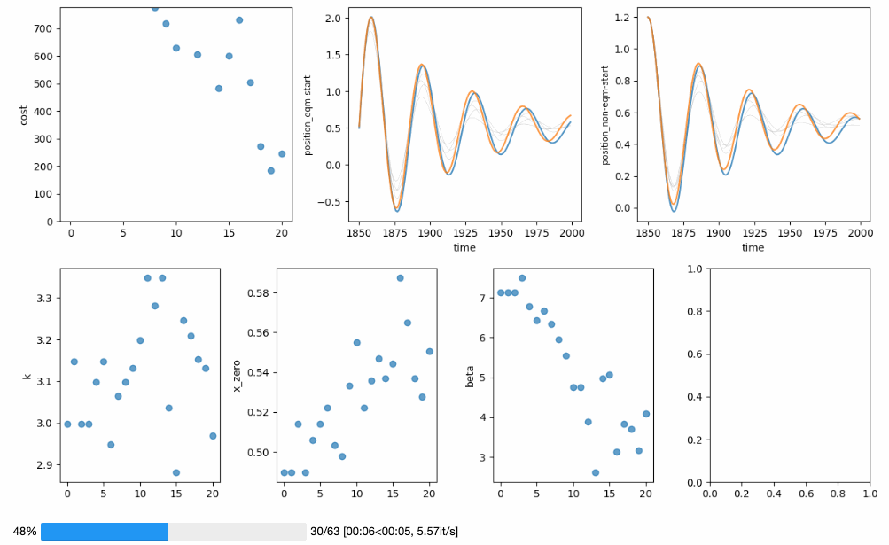
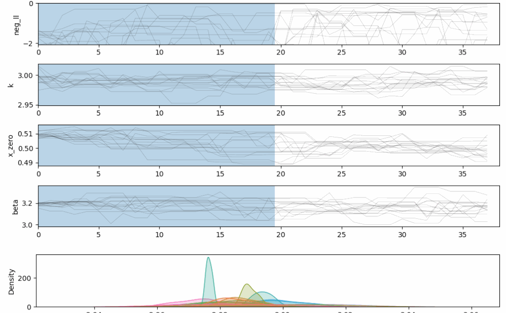

.. Documentation master file

.. include:: ../../README.rst
    :start-after: sec-begin-description
    :end-before: sec-end-description

OpenSCM-Calibration supports multiple types of optimisation and fitting

**Global optimisation**

**Local optimisation**

**Markov chain Monte Carlo**

For more usage examples, checkout :ref:`the notebooks <notebooks-reference>`.

.. include:: ../../README.rst
    :start-after: sec-begin-installation
    :end-before: sec-end-installation

.. toctree::
   :maxdepth: 2
   :caption: Contents:

   notebooks

.. toctree::
    :maxdepth: 1
    :caption: API reference

    cost
    emcee_utils
    emcee_plotting
    iter_utils
    minimize
    model_runner
    scipy_plotting
    scmdata_utils
    store

Index
-----

- :ref:`genindex`
- :ref:`modindex`
- :ref:`search`
